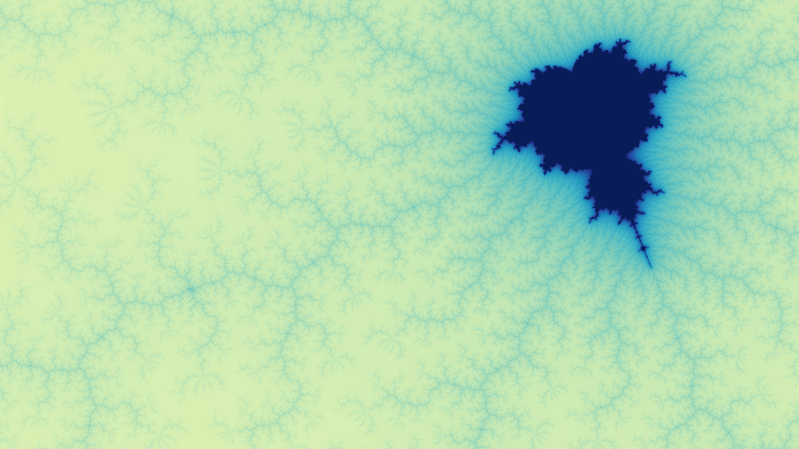

# AI-Fractals



## Overview

This project explores the intersection of artificial intelligence and fractal geometry, combining machine learning techniques with traditional fractal mathematics to generate and analyze fractal patterns.

The project is inspired by research from **Douglas C. Youvan** (doug@youvan.com), detailed in the paper [AI-Enhanced Fractal Geometry: Merging Machine Learning with Traditional Fractal Mathematics](docs/ai-enhanced-fractal-geometry.md).

AI-Fractals provides:

1. A **fractal generation library** (`ai_fractals/`)
2. A **dataset pipeline** for generating large-scale RGB and shoreline datasets
3. Tools for **CNN-based embedding learning** from fractal shorelines (in progress)
4. Infrastructure for **GAN-based pseudo-fractal generation** (in progress)

## project Status (June 2026)

Completed:
- **Automatic Fractal Generation**: Generate Mandelbrot and Julia set fractals with configurable parameters
- **Shoreline Extraction**:
    - Extract and analyze fractal shoreline patterns from generated fractals, or
    - create Shorelines from scratch in big batches
- **CUDA acceleration**: Both in conventional generation and in GANs training. Also see https://github.com/TomLemsky/pytorch-fractals?tab=readme-ov-file
- **Supersampling techniques**: upsampling -> downsampling -> gaussian blur, for smoother fractals

In Progress:
- **AI Training**: Train neural networks (CNNs, GANs) on fractal datasets to generate pseudo-fractals
- **Julia Set**: Initial infrastructure for Julia set generation is implemented (GPU/CPU backends, parameter handling, tile‑search integration).


## Directory Structure
```
.
├── docs/
├── dataset/                        # training data - default output of dataset_builder (too big to store on GH)
├── example_images/                 # So far, only regularly generated (no CNN / GANs, yet)
├── notebooks/                      # demos, prototyping
├── scripts/
│   ├── cli_dataset_builder.py      # for creating the training-dataset (usage, see below)
│   ├── etc...
│   └── readme.md                   # please check folders readme for a rundown on all scripts..
└── src/
    └── ai_fractals/
        ├── analysis                # module for evaluating fractals (used for both generating and training)
        ├── data                    # dataset and shoreline builders
        ├── generators              # the fractal generators (Mandelbrot, Julia, etc)
        ├── models                  # models (CNN, VAEs and GANs)
        ├── processing              # for processing, edge-detection, filters, flipping images
        └── training                # for training ai-models
```

## Typical Workflow

1. Explore conventional fractal generation using the CLI:
       python scripts/cli_dataset_builder.py

2. Generate RGB datasets:
       python scripts/batch_builders/dataset_batch_builder.py

3. Generate shoreline datasets (recommended for CNN training):
       python scripts/batch_builders/shorelines_batch_builder.py

4. Train a CNN on shoreline images to obtain geometry-based embeddings (future work).

5. Use these embeddings to condition or guide GAN models (future work).


## Installation

Requires Python 3.10 or higher.

Clone and install:

```bash
# Clone the repository
git clone https://github.com/Dyretna/AI-fractals.git
cd AI-fractals

# Install package
pip install -e .
```
Depending on your hardware, install the appropriate PyTorch build.


### CUDA (Nvidia GPU)
```bash
# install Pytorch with CUDA
pip install torch torchvision --index-url https://download.pytorch.org/whl/cu121
```
### CPU-only (NO GPU required)
```bash
# Install PyTorch - CPU‑only
pip install torch torchvision --index-url https://download.pytorch.org/whl/cpu
```


### Set environment paths with python-dotenv
This repo makes use of load_dotenv() from python-dotenv.
Set your project directory in a `.env` file:

```
PROJECT_ROOT=/path/to/AI-fractals
```

Then all paths will load correctly.


## CLI Usage
The project includes a command-line runner for generating fractal datasets:

Basic usage (default: 50 Mandelbrot images):

    python scripts/cli_dataset_builder.py

High-resolution output:

    python scripts/cli_dataset_builder.py \
        --width 2048 \
        --height 2048 \
        --max_iter 1500

### CLI Arguments
    --n          Number of images to generate (default: 50)
    --type       Fractal type: mandelbrot or julia (default: mandelbrot)
    --width      Image width in pixels (default: 1024)
    --height     Image height in pixels (default: 1024)
    --max_iter   Maximum iterations for the fractal generator (default: 1024)
    --cmap       Matplotlib colormap name (default: twilight)
    --out        Output directory (default: PROJECT_ROOT/dataset/fractals/<type>)

## Research Background

This project implements concepts from AI-enhanced fractal geometry, where machine learning models are trained on traditional fractal patterns to:

1. **Learn fractal characteristics**: CNNs extract features from fractal shorelines
2. **Generate new patterns**: GANs create novel pseudo-fractals with learned properties
3. **Analyze complexity**: Study the fractal dimension and properties of generated patterns

These components are planned but not yet implemented.

## Author

**Jesper Anteryd** (jesper.anteryd@proton.me)
Inspired by the research of **Douglas C. Youvan**

## License

See [LICENSE](LICENSE) file for details.

## References

- Youvan, D.C. "AI-Enhanced Fractal Geometry: Merging Machine Learning with Traditional Fractal Mathematics"
