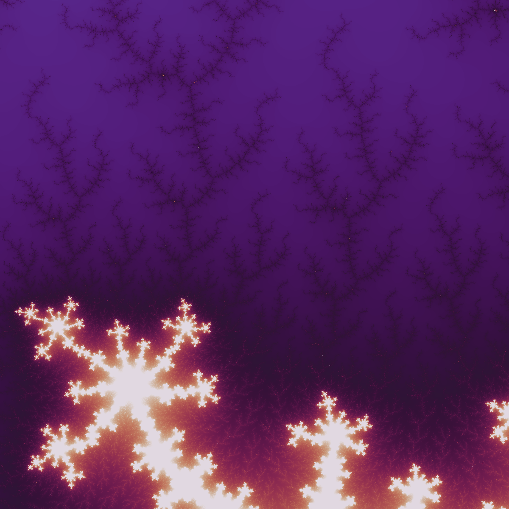

# AI-Fractals

AI-Enhanced Fractal Geometry: Merging Machine Learning with Traditional Fractal Mathematics



## Overview

This project explores the intersection of artificial intelligence and fractal geometry, combining machine learning techniques with traditional fractal mathematics to generate and analyze fractal patterns. The work is inspired by research from **Douglas C. Youvan** (doug@youvan.com), detailed in the paper [AI-Enhanced Fractal Geometry: Merging Machine Learning with Traditional Fractal Mathematics](docs/AI-EnhancedFractalGeometry-MergingMachineLearningwithTraditionalFractalMathematics.pdf).

## Features

- **Fractal Generation**: Generate Mandelbrot and Julia set fractals with configurable parameters
- **Shoreline Extraction**: Extract and analyze fractal shoreline patterns from generated fractals
- **AI Training**: Train neural networks (CNNs, GANs) on fractal datasets to generate pseudo-fractals
- **Image Pipeline**: Automated saving and processing of fractal images

## Project Structure

## Installation

Requires Python 3.10 or higher.

### Basic Installation

```bash
# Clone the repository
git clone https://github.com/Dyretna/AI-fractals.git
cd AI-fractals

# Install dependencies
pip install -e .

# For development
pip install -e ".[dev]"
```

## Research Background

This project implements concepts from AI-enhanced fractal geometry, where machine learning models are trained on traditional fractal patterns to:

1. **Learn fractal characteristics**: CNNs extract features from fractal shorelines
2. **Generate new patterns**: GANs create novel pseudo-fractals with learned properties
3. **Analyze complexity**: Study the fractal dimension and properties of generated patterns

The approach bridges classical fractal mathematics with modern deep learning, enabling exploration of new fractal-like structures.

## Configuration

Set your project directory in a `.env` file:

```
PROJECT_DIR=/path/to/AI-fractals
```

## License

See [LICENSE](LICENSE) file for details.

## Author

**Jesper Anteryd** (jesper.anteryd@proton.me)

Inspired by the research of **Douglas C. Youvan**

## References

- Youvan, D.C. "AI-Enhanced Fractal Geometry: Merging Machine Learning with Traditional Fractal Mathematics"
- [Project Repository](https://github.com/Dyretna/AI-fractals)
