# Devlog

## **July 6, 2026**
The testing of the VAE was successful. Even though the synthetic shorelines tend to form one large cluster in an empty region of the space, they still sit between the blue areas and well inside the manifold. There are small islands of real and synthetic points around the main cluster, but overall it looks fine.

I then tested interpolation of both the CNN and VAE embeddings. The VAE interpolation produced an interesting transition. Will be interesting to try this on the GANs model!

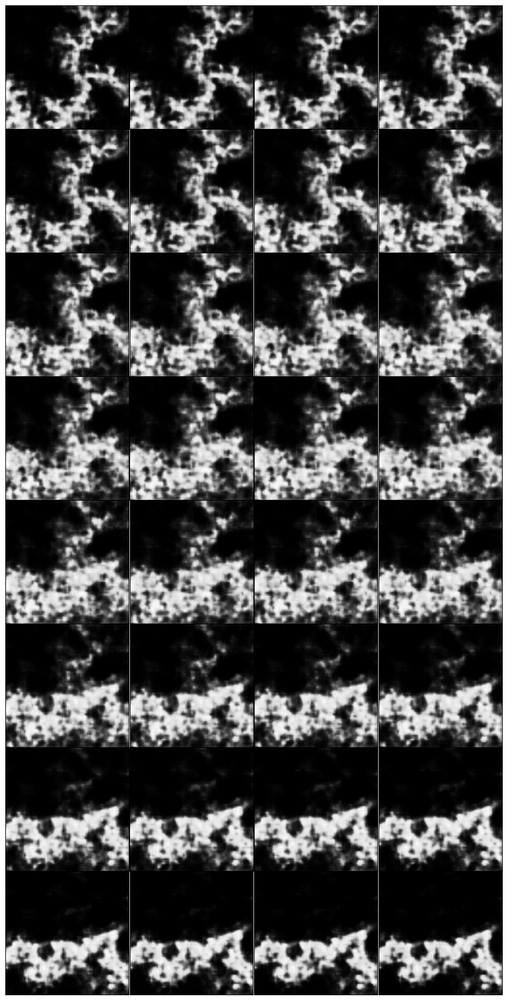

-------

So… I kicked off a new conditional WGAN run. The whole pipeline works — data flows, embeddings attach correctly, conditioning is active — but the results are still abstract “modern art” rather than anything resembling fractals. Even with embeddings, the improvement is barely noticeable.

Epoch 1, 10, 20, 40, 80 all show the same pattern: soft blobs, color patches, and vague structures that never settle into the sharp fractal geometry the model is supposed to learn. I killed it shortly afte rhere, maybe a bit early, but did not seem like a good idea to finnish "for science" in this case. we have the samples we need.

epoch 1:

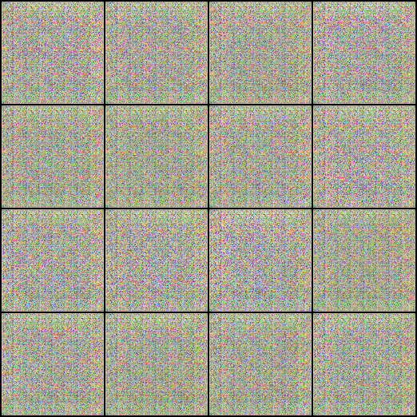

epoch 10:

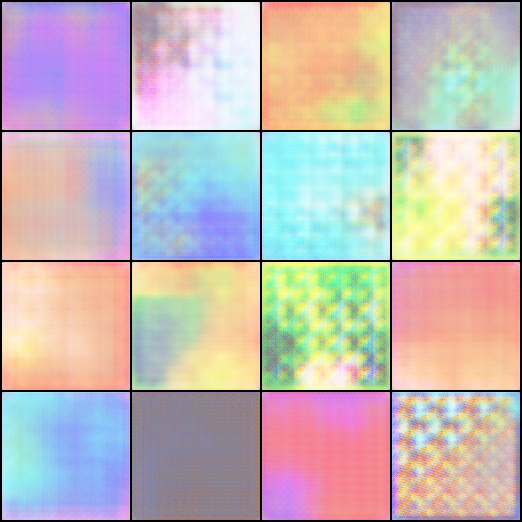

epoch 20:

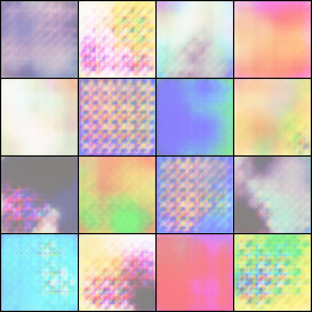

epoch 40:

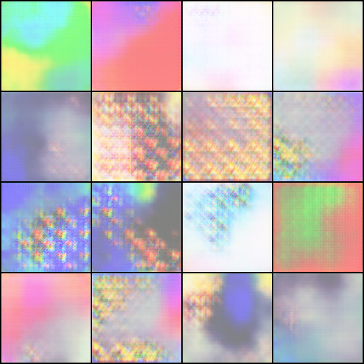

epoch 80:

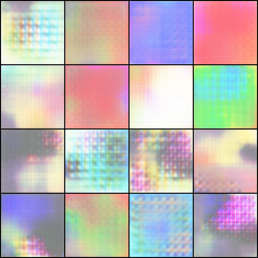

After discussing this with **the best co‑pilot ever made**, the plan for the next run is now so crystal clear that it is even clearer than the POTUS pool:

1. Switching to a single colormap. Multiple cmaps introduce unnecessary style noise and force the critic to learn color variation instead of geometry. Twilight‑shifted only. Clean and consistent. it will be done overnight perhaps...

2. Cleaning up the embeddings. I’ll look into how Youvan approached this — possibly PCA, maybe a small linear layer, maybe smoothing the manifold. The goal is to make the conditioning signal more stable and easier for the critic to interpret.

3. Improving batch training. Larger batch size, stratified sampling, embedding‑sorted batches, and maybe increasing n_critic to 4 or 5. The idea is to stop feeding the critic chaotic batches and instead give it structured, consistent information.

So the plan is to run each of these improvements as separate training sessions. That way it’s actually possible to see whether each change does anything measurable, instead of mixing everything at once and guessing. I’ll save the trainer state for every run so I can compare behaviour between them. The rest of the pipeline doesn’t need major changes right now — but I’ll adjust things if any of the runs reveal something unexpected.

## **July 3, 2026**
A lot has happened since the last entry, and several parts of the fractal pipeline have now matured into their next iteration.

I decided to settle on the shoreline detector without smoothing. After running multiple tests, it became clear that Gaussian blur consistently removed thin edges that the evaluator depends on. The “liberal Canny” setup preserves more structure, increases pass‑rate, and produces shorelines that are more useful for downstream geometry learning. In hindsight, I could have tested other smoothing methods that might have preserved thin lines — oh well, maybe later.

I generated a large batch of new metadata using both 6‑tile and 7‑tile region configs. Mixing tile sizes increases geometric variety: 7×7 tiles give deeper zooms and smaller bounds, while 6×6 tiles produce more mid‑scale regions. This combination should help both the CNN and VAE learn a broader manifold. After running the full shoreline‑evaluation pipeline, I now have over **10,000 accepted fractal regions**, sorted into evaluated/rejected sets. I might train a few more 5×5 regions as well, since some older ones are still saved.

I wrote a new RGB batch generator and produced most of the RGB dataset for GAN training. Around 3,000 regions remain — I’ll just let it run later when AFK.

With the expanded shoreline dataset, I retrained the self‑supervised CNN. The new model is trained entirely on the updated “evaluated” shorelines and shows cleaner clusters and more stable UMAP/HDBSCAN structure. This embedding space will be used for GAN conditioning and similarity search.

Here’s a map of the clusters from the notebook:

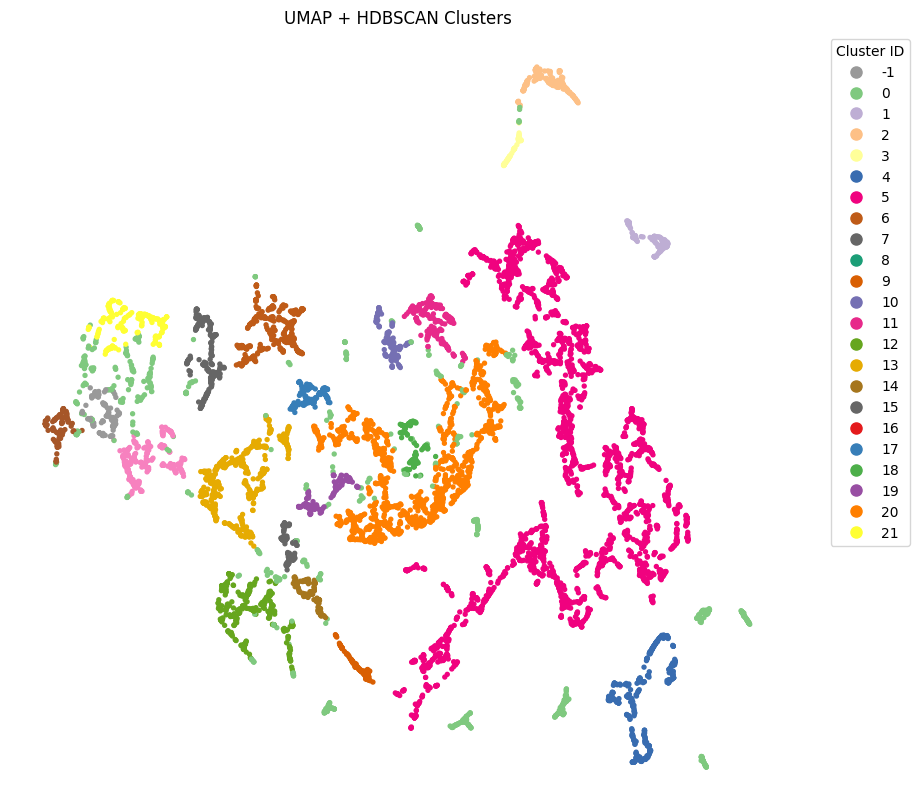

The clusters themselves won’t be used directly, but they’re a good sanity check that the embedding space actually works. I didn’t bother tuning HDBSCAN parameters here — this was just a quick visualization pass.

The biggest news is the conditional VAE. The VAE receives both the shoreline mask and the fractal bounds, allowing it to learn a position‑aware latent space. I added a new ShorelineVAE model, a dedicated trainer, and a new training script. All data loaders were updated to support shoreline + region metadata, including robust JSON matching via compact_id.

The first full VAE run (60 epochs) completed successfully. Loss dropped smoothly from ~30k down to ~15.9k.

Before moving on to GAN conditioning, I need to check whether the VAE actually learned the “shape” of all shoreline images. The UMAP plot above is a good example of this shape. The **latent space** is like the coordinate system where the model places images as points. Every shoreline becomes a dot somewhere in this space. Similar shorelines end up close together, different ones end up farther apart. If you plot all these dots, they form a kind of cloud — and that cloud is what is called a **manifold**. It’s basically the “shape” formed by all valid shoreline geometries.

A good VAE should learn this shape. That means:
- if I generate a synthetic shoreline, its dot should land inside the cloud
- if I interpolate between two shorelines, the dots should form a smooth path between them
- if I sample a random point, the decoded image should still look like a real shoreline

In other words: synthetic shorelines should appear **in the gaps between real ones**, but still **on the same overall shape**. They shouldn’t drift off into some strange corner, and they shouldn’t collapse into one tiny cluster. If they do, the model hasn’t learned the real geometry.

So the next step is simple: generate synthetic shorelines, run them through the frozen CNN, and plot them together with the real embeddings. If the synthetic ones blend in naturally — same neighborhoods, same structure — then the VAE is good enough for GAN conditioning. If they land outside the cloud, I’ll know the model needs more variation or a deeper architecture.

## **July 1st, 2026**
While generating shoreline metadata, I realized I needed a clearer way to understand how the evaluator behaves inside the shoreline pipeline. The tile‑search stage already does some evaluation, but it’s intentionally forgiving: if no tile passes, it simply chooses the best tile and goes deeper, explores the next zoom level, and picks a random candidate among the accepted ones. That gives variation, which is good for dataset diversity.

But shoreline generation is different. Here I wanted a second, stricter sorting step: good regions should be separated from bad ones. So metadata ends up in raw, evaluated, and rejected, and shoreline images follow the same pattern. To make sense of this, I started experimenting with edge‑detector parameters, evaluator thresholds, and wrote a script to visually compare outputs and see which ones passed or failed.

The evaluator itself follows Youvan’s composite scoring idea. It doesn’t “look” at the fractal the way a human does. It measures statistical signals: fractal dimension, entropy, pixel variance, and edge density. Each metric contributes a percentage to the final score. Before any of that, it checks whether the tile actually contains part of the fractal boundary. If the tile is basically all inside or all outside the set, the score is forced to zero and everything is rejected immediately.

To a layman: the evaluator is a mathematical judge. It doesn’t care about pretty spirals or interesting shapes. It cares about whether the image has the right amount of complexity, randomness, variation, and edge structure. If those numbers fall outside the expected ranges, the evaluator says “fail,” even if the image looks visually rich. It’s a statistical filter, not an aesthetic one.

This is why tuning the edge detector matters so much. The evaluator’s metrics depend entirely on the edges you extract. If the edges are too thin, too noisy, too blurred, or too fragmented, the statistical profile changes and the evaluator rejects images that a human would consider perfectly valid fractal regions. The whole exercise was about understanding this mismatch and finding detector settings that produce edges the evaluator can interpret correctly.

I ran four tests to compare how smoothing affects the edges, and how `max_iter` in the shoreline generator influences the results. What complicates things is that metadata was produced at different periods, using different iteration limits (older tiles down to 256, newer ones at 1024). Newer metadata also uses 7×7 tiles instead of 5×5, which means deeper zoom levels and naturally smaller bounds. At depth level 10, shorelines generated with `max_iter = 2048` show much more detail, while `max_iter = 1024` sometimes fails — though rarely.

Here’s an example of a cardioid with very different levels of detail, all of which passed:

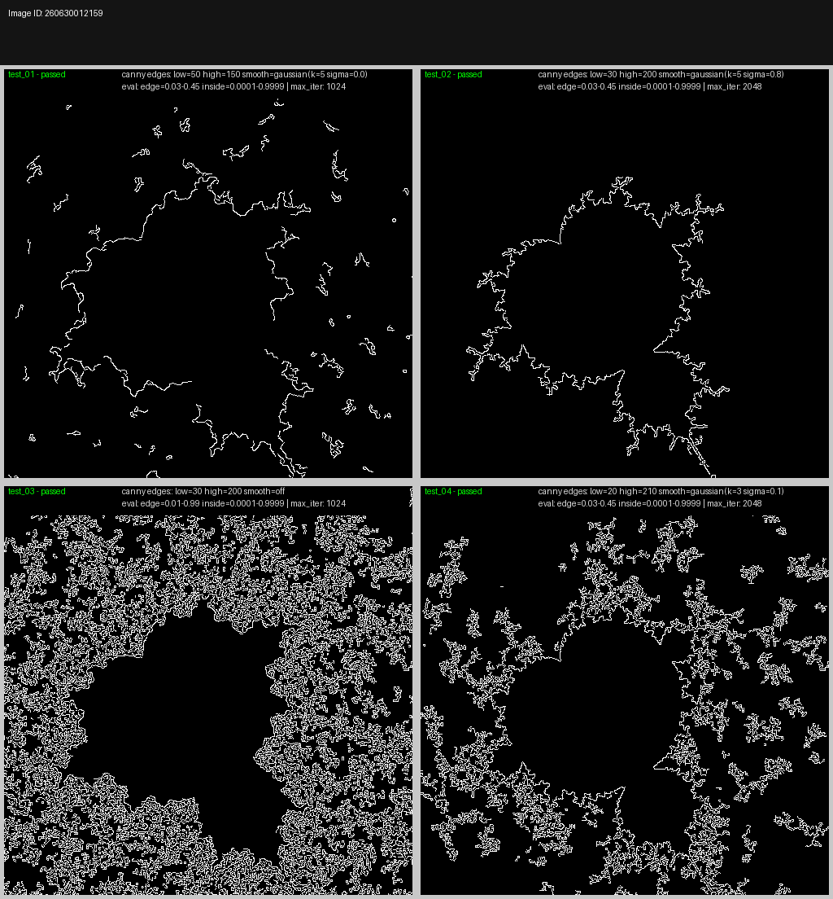

We can see that test 03 — the only test without Gaussian smoothing — picks up a lot of structure, maybe even too much. Remember, we don’t only want images that pass; we also want shoreline images that are useful for training GANs alongside the RGB versions of the same regions. At deeper zoom levels, the situation flips: higher max_iter becomes necessary, and lower iteration counts sometimes fail:

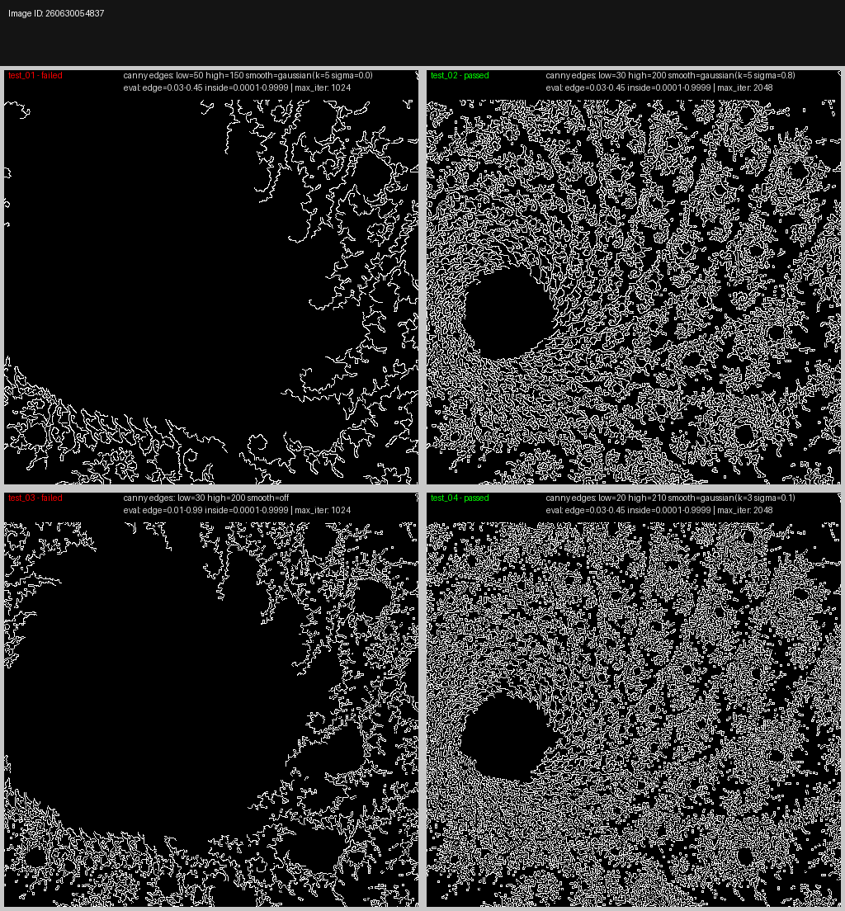

But often low iteration counts still produce enough structure to pass, and might even be acceptable for GAN training. It will be interesting to see how different colormaps behave here. Smoothing may or may not be needed:

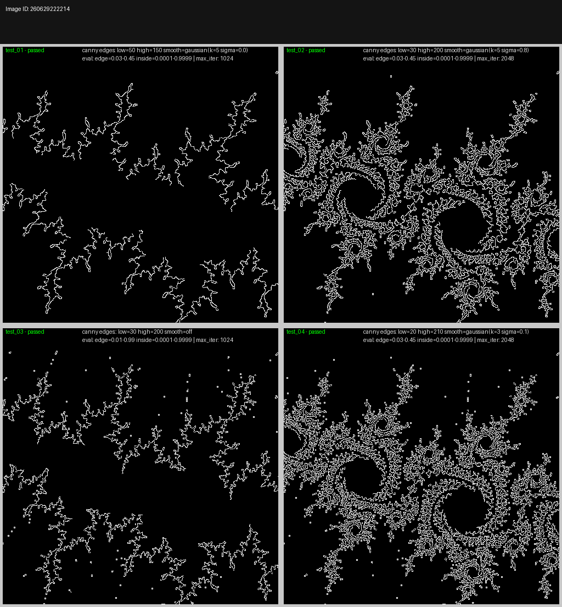
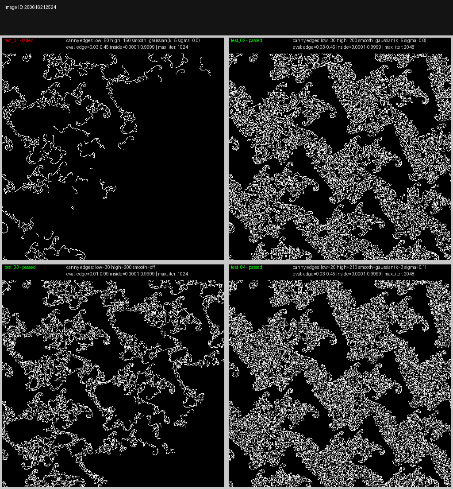
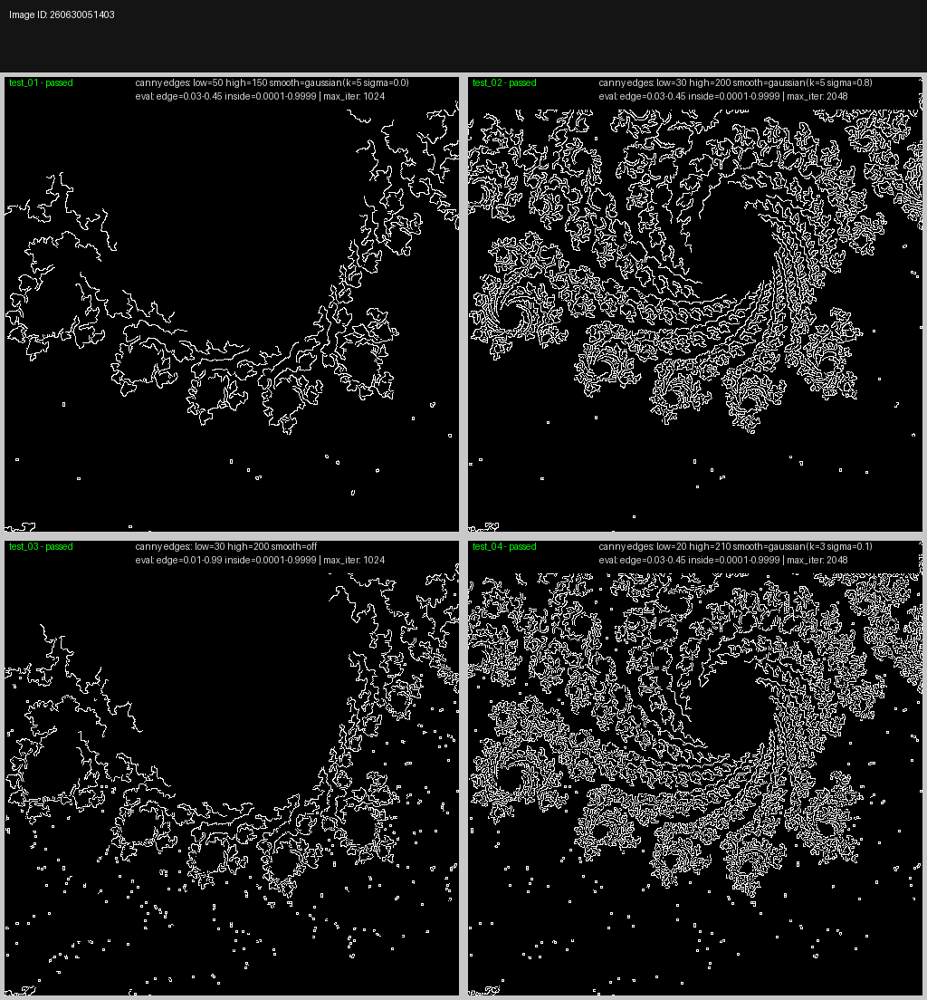

Most comparisons show that we retain more data and more shoreline structure when either smoothing is disabled or max_iter is low:

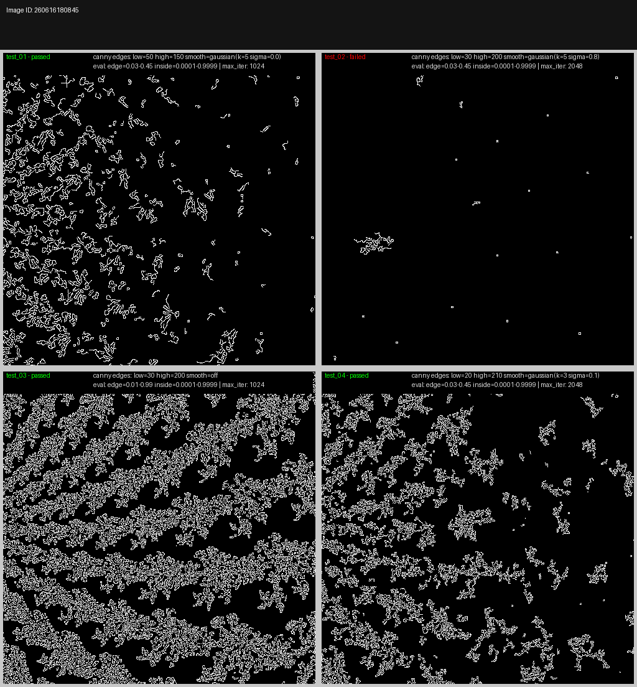
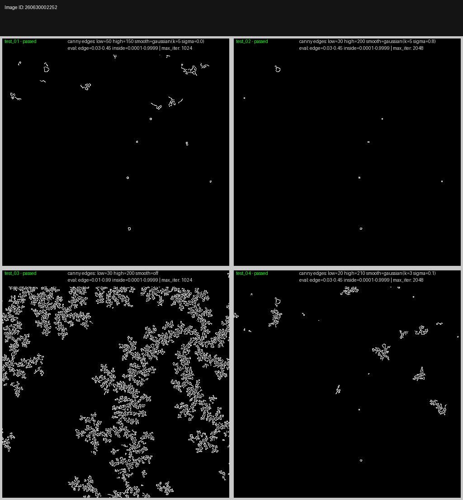

This suggests that smoothing risks eliminating thin edges, even at low values.

The table below shows evaluated vs rejected counts for each test:

| Test   | Evaluated | Rejected |
|--------|-----------|----------|
| test 1 | 3854      | 1514     |
| test 2 | 2835      | 2533     |
| test 3 | 3919      | 1449     |
| test 4 | 2894      | 2474     |
| test 5 | 4001      | 1367     |

But what is test number five? There are cases where all tests fail — even test 3 — despite clearly showing structure:

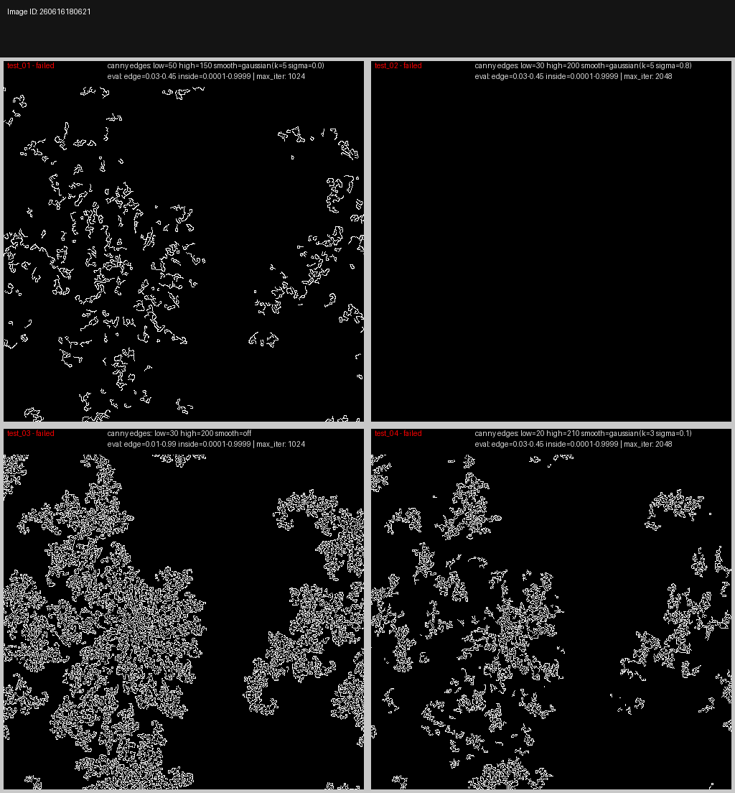

Test 5 is essentially test 3 (no smoothing) but with an extra processing step: dilation. Dilation thickens thin lines. The idea was to make the image less “noisy,” which the evaluator dislikes. It’s not aesthetically pleasing, and I’m not sure whether it harms the embedding structure for the GAN model:

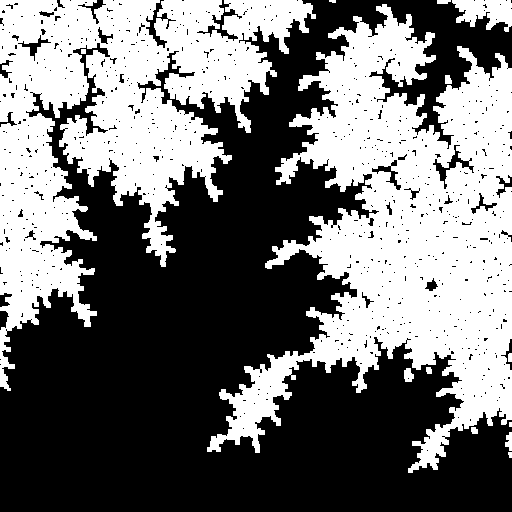

Right now I’m leaning toward sticking with the test 3 approach: a liberal Canny without smoothing. It may filter some images out, but it’s simple, fast, and seems to preserve the most useful structure. The ones that fails on higher depth, simply tells us to set max_depth lower (one step should be fine).

## **June 30, 2026**
I started working on the new pipeline yesterday. Not totally sure about the naming conventions yet, but hear me out: I rewrote the dataset builders into a single “region” builder that handles the tilesearch but skips all high‑res rendering. It only saves metadata — bounds, zoom depth, evaluation score, and so on.

These metadata files are stored as JSON under /dataset/region.

Then both shorelines and RGBs are rendered from the metadata. So the old dataset builders aren’t really needed anymore; we only need the region builder, and then lightweight scripts take care of the rest. Much cleaner.

I also wrote a script that removes metadata files with duplicate bounds or fractal coordinates. And when creating shorelines, there’s an additional evaluation step that sorts regions into evaluated or rejected, and shorelines are saved following the same structure so even rejected ones can be inspected.

This means we need to build shorelines and RGBs based on the metadata — but some RGBs can be reused, since I saved metadata for them earlier (I stopped saving metadata at one point because I thought it was useless, haha). Shorelines will all have to be rerun. I now have around 5000 metadata files.

So the idea is: now we can group metadata, RGBs, shorelines… we can render coordinates at different resolutions and colormaps, and this will help embeddings and GANs a lot. Nice. We’ll see how long it takes before I have to eat this up though, haha.

## **June 29, 2026**
I finally got a WGAN‑GP model running today. The output images are 128×128. I actually tried something similar yesterday with 256×256, but that run was estimated to take around 33 hours. I started it anyway, but I didn’t have a proper logger, no sample images during training, no checkpoints I could actually use. And honestly, I need to apply for jobs and keep my life moving, so waiting 33 hours wasn’t exactly ideal.

So I dropped the resolution to 128, added the essential logging I needed — sample images, checkpoints (huge files, half a gig each, and I didn’t even use them). But things started happening. Look at this:

epoch 1:
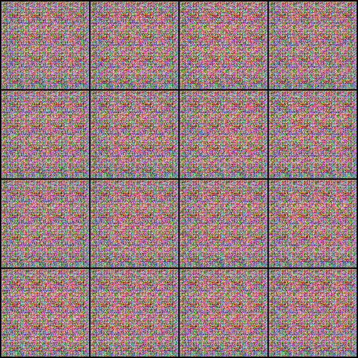

epoch 10:
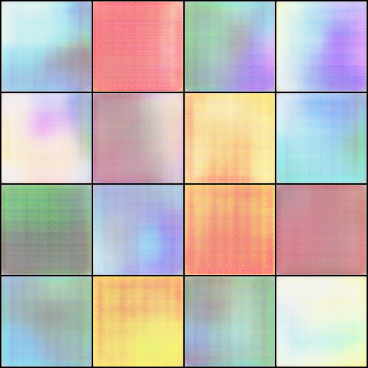

epoch 20:
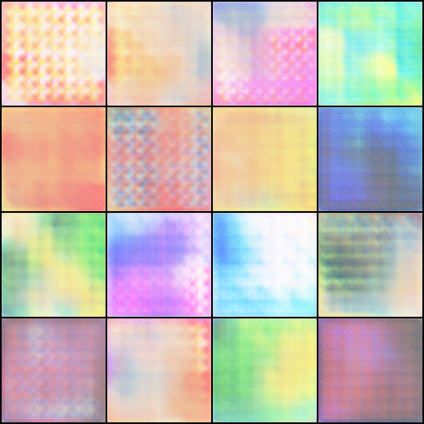

epoch 40:
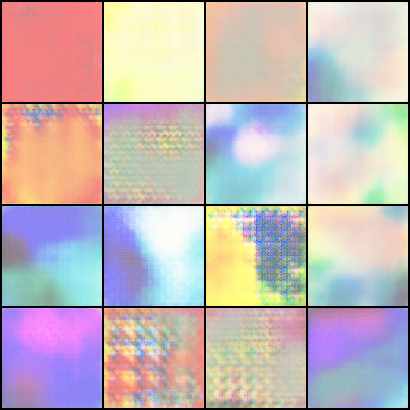

epoch 80:
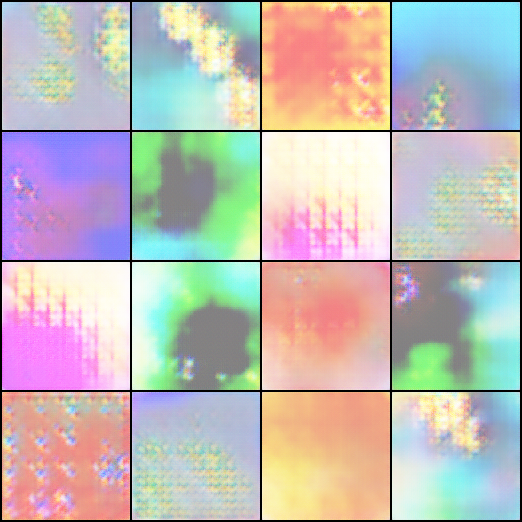

epoch 120:
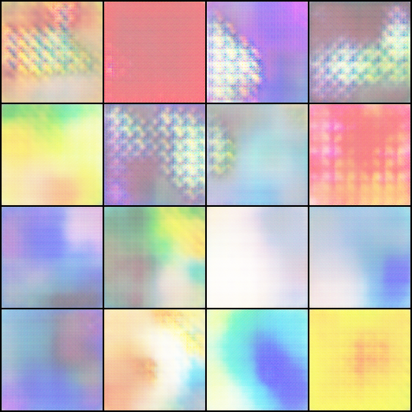

epoch 180:
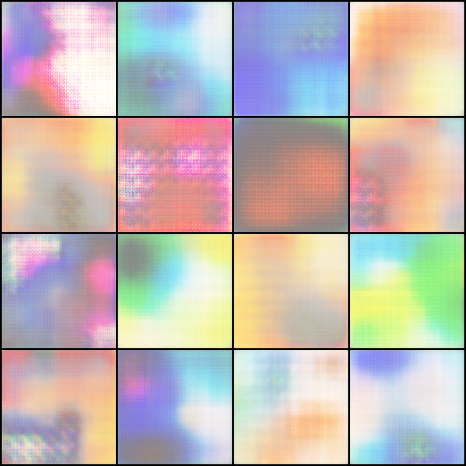

I stopped at epoch 180. I had planned to go to 200, but honestly, the model had already flattened out around epoch 80. Still, it was really fun to see it working. But it’s obvious that the GAN needs to understand structure better. Luckily, we already have a VAE model that can pair our dataset of roughly 5000 images with structural embeddings.

Right now the GAN is basically staring at the color gradients and ignoring the underlying geometry. With shoreline VAE embeddings we can cluster structural patterns and feed that into the GAN so it learns the actual shapes instead of just the colors.

The problem is that we don’t have enough shoreline samples, and the VAE is too simple. On top of that, I built two completely separate pipelines for RGB images and shorelines — they don’t share metadata. I know I should’ve thought about that earlier, but at least the infrastructure exists. I just need to simplify it again.

It feels like one step forward and two steps back. The idea now is to have a clean stage that focuses on generating shared metadata using the tile‑search algorithm (which also evaluates fractals). That metadata gets saved. Then RGB and shoreline builders run on top of that metadata. Much cleaner. We can generate different colormaps, different max_iter values, different resolutions, all from the same fractal regions.

And I want to share the fractals I’ve found. You only need to run a script that generates high‑res representations of the coordinates. The tile‑search part is the slow one.

What bothers me right now is that if I want to go deep, I need a pretty high max_iter. That affects performance. If I split a fractal into 7×7 tiles at 256×256 resolution, I need to evaluate each tile and collect all candidates that pass the metrics. From those candidates I pick the top ones, and then randomly choose one to increase variation. If max_iter is low, it’s fast, but I get fewer candidates and risk revisiting the same tiles over and over.

That’s why I added jittering, so each zoom shakes the coordinates a bit. But it’s still a bit shaky. Should I make max_iter dynamic depending on depth? Maybe it works well in some regions but not others.

Right now, with the current config, I just hardcode max_iter=1024 to find more candidates. The high‑res generators choose their own colormaps, resolutions, and max_iter values.

Despite all this, after two weeks of refining the dataset generation pipeline, I finally got a taste of GAN output today. I need to go back and build a better pipeline for more stable training data so we can get better embeddings. But that’s how it goes.

## **June 27, 2026**

I’ve made a new batch of 2000 images running overnight — iter 1024 on the tile‑search generator, but double that for the high‑res images. Max depth is 8, and since I’m using 7 tiles, each step becomes a more aggressive zoom because every tile is relatively smaller. It’s weird — on some colormaps max_depth 8 feels pretty balanced, on others not at all. Could also be that the camera ended up in a strange location.

Still curating the colormaps. Three‑color gradients and Seasons have to go — too boring. Also Pastel, since they’re too bright and I don’t have the energy to fix them afterwards.

I’d like to make a shorter run with only the discrete gradient colormaps (like Accent, Paired, Tab and the Set series). They give quite psychedelic effects, and I’m very interested to see how the GANs will handle them together with everything else. Even though the VAE doesn’t know anything about the structures these colormaps create (it runs on the BW raw math structures), so we can’t interpolate between different colormaps, it’s still trained on different RGB images, so… yeah, we’ll see. But making such a run… hmm. I’ve more or less hardcoded using CURATED_COLORMAPS in the batch runner… hmm. We could expose the different CONSTANTS in the CLI and make a selection there? (Individual colormaps would be too much work for the end user.) `--help` could show the different options. Could work. Also, wierd that i still have colormaps in Shoreline configs...

---

came to think of the simple fractal generator. i Actually have not it since i refactored the generation pipeline - It most certainly is broken - it i don't think a somple generator without configs is actaully doable anymore... damn... maybe we should just drop it? yeah probably... damn. i mean, we could just make a new pipeline that is very easy to configure through the cli using the same components, jsut without the configs... hm.
ah just want to feel progress haha... man.

---

I was assigning the device with pytorch in the datasetbuilder still - not needed, that should be done early on in the configs -> generator scripts. also saw that we used a boolen flag for assigning devide - proboably better to just use "device" as signature - so om changing that, and adds it as attribute to BaseFractalGenerator. cleaning up the factory a a bit... and all the configs... lol.

## First Entry, **June 26, 2026**

I’ve been working on this project for a while now, and today feels like a good moment to stop and actually write down where things are, how they got here, and what the hell I’ve been doing. The codebase has changed a bit since i started out,  So here’s a recap...

---

### Early Days — Naive Dataset Generation

The project started out with finding the article that the repo builds upon,
then using the generators i found to generate a bunch of fractals and save them.

the author shows a `fractal_walk` method that could be used but my implementation was poor - I realized that I needed a better way to *find* interesting regions automatically. That’s when the first tile-search experiments began — messy, notebook-driven prototypes that barely held together but proved the concept.

---

### Shorelines, Augmenters, and Saving Too Many Images

Once I had tile-search working, I started extracting shorelines.
The first version used a standalone augmenter that saved every augmented image to disk. It did the job, but it also produced **massive** datasets — thousands of files per batch, many of them redundant.

---

### The First CNN and clustering — “Holy shit, it works”

This was a fun moment.
felt like gettin' learnt with Ricky:
https://www.youtube.com/watch?v=ewz2cFUUyck

I trained a self-supervised CNN on shoreline images, and the embeddings actually clustered in meaningful ways. Different fractal structures grouped together. The latent space wasn’t random noise — it had shape.

Then I built a shoreline autoencoder (a small VAE), and that worked too.
Not perfect, but enough to prove that the geometry of fractals *can* be learned.

This was the first time the project felt like more than a generator.
It felt like an AI system.

After buildning the CNN i realized that PyTorch can do augmentation on-the-fly, in the dataloader. So the old augmenter was removed.

---

### The Big Refactor — Builders, Strategies, and a Cleaner Design

After removing the augmentation step and simplifying the shoreline pipeline, I took a step back and realized that the RGB and shoreline builders were not as different as they looked. In many ways, they could follow the same overall structure, just with different steps and outputs. They are still separate for now, but a lot of work has gone into making them feel like two variations of the same pipeline rather than two unrelated systems.

Several simplifications came out of this:

- Tile-search was moved into its own module with pluggable strategies (basic, jittered, and more in the future).
- The shoreline builder was reorganized into clear, explicit steps.
- The RGB builder was cleaned up and aligned with the structure of the shoreline builder.
- Old scripts and leftover code were removed.
- The Julia generator had become difficult to maintain due to unstable parameter handling and awkward bounds logic. It created more complexity than value at this stage, so it was removed during the simplification process. The plan is to bring it back later, once the overall pipeline is stable and the parameter strategy is clearer.
- Naming conventions were cleaned up across the codebase.

This refactor made the entire project feel more coherent. The builders now share a common shape, the tile-search logic is isolated and easier to extend, and the codebase is much easier to navigate. Julia will return eventually, but only when the design is ready for her.

---

### Today — Unified Batch Pipelines and a Proper CLI

This brings me to today’s work.

I finally built a **config-driven batch CLI** that can run multiple pipelines in sequence.
Each YAML config now has a `job_type` field (`rgb` or `shoreline`), and the CLI dispatches to the correct builder automatically.

One thing that has become increasingly clear while working on the batch pipeline is how strongly `max_iter` influences the entire generation process. Higher iteration counts allow deeper zooms and more detailed fractal structures, but they also make every step more expensive. This directly affects what values for `min_depth` and `max_depth` make sense for a given profile.

At the same time, `n_tiles` controls how much exploration tile-search performs. It determines how many candidate regions are evaluated before selecting one to zoom into. Unlike `max_iter`, `n_tiles` is not tied to fractal detail, but the two interact in practice: when both are high, the total cost grows quickly. Each tile must be rendered at a reasonable resolution, and with a high iteration count this becomes slow. So increasing both `max_iter` and `n_tiles` at the same time leads to very long generation times. Since every tile becomes smaller with increase of `n_tiles`, this also increases the zoom.

This raises the question of whether the current tile-search strategy is the right one. It works, and it produces good results, but it may not be the most efficient approach when iteration counts are high. It is worth considering whether alternative strategies could reduce the cost without losing the exploratory behavior that tile-search provides.

For now, the important point is that iteration profiles need to reflect these relationships:

- `max_iter` controls detail level and feasible zoom depth.
- This determines what `min_depth` and `max_depth` should be.
- `n_tiles` controls exploration and is a separate heuristic.
- High `max_iter` combined with high `n_tiles` becomes very expensive.

Because of this, it makes sense to define multiple iteration profiles, each with its own parameters. A single config file becomes too limited when different iteration levels require different depth rules and tile-search settings. The cleanest solution is to have several config files, for example:

configs/rgb_256.yaml
configs/rgb_512.yaml
configs/rgb_1024.yaml

Each config defines its own iteration profile, and the batch CLI can run several of them in sequence. This makes it easy to test different combinations of iteration levels and zoom depths, and it keeps the pipeline flexible and easy to extend.

the quest for less expensive search strategies goes on...

---

### what's next
first and foremost:
- tweak on the configs for the batch pipelines, and think about better search strategies

in due time:
- Create the first GAN models (probably a simple DCGAN baseline to start)
- Experiment with conditioning GANs using the CNN embeddings
- Test whether the GAN can follow “directions” — e.g., generate fractals with certain geometric properties

peace out!
